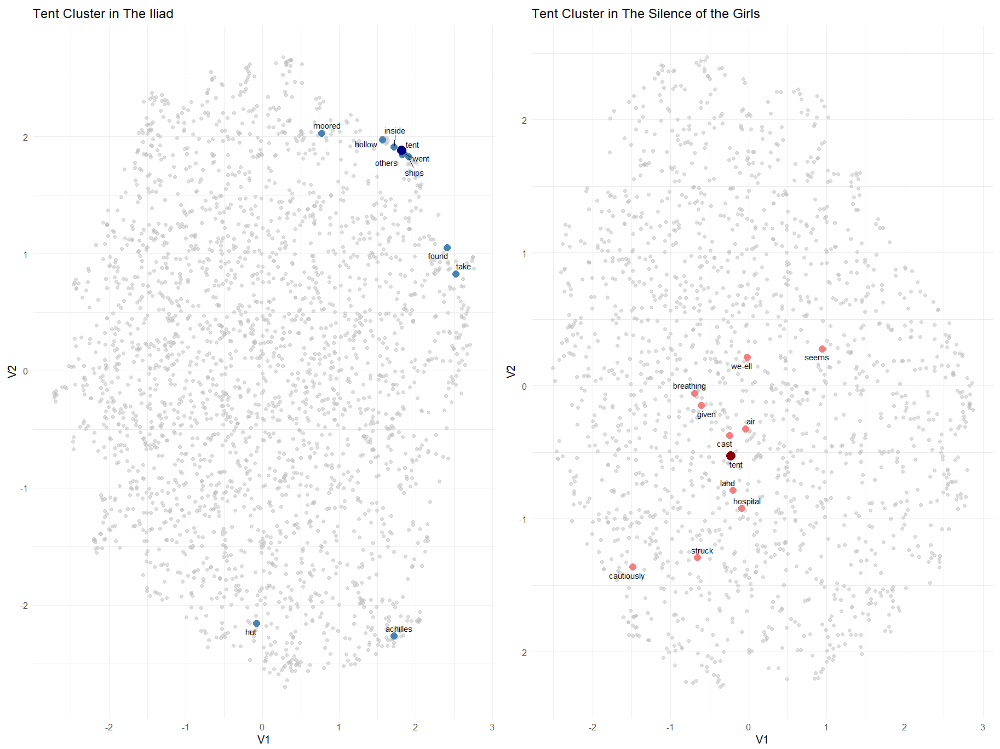
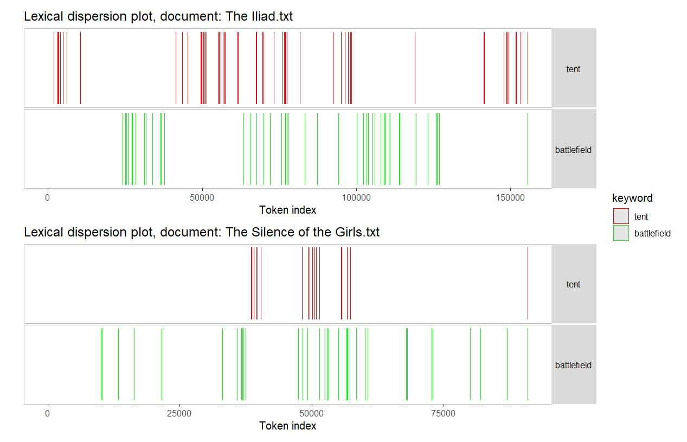
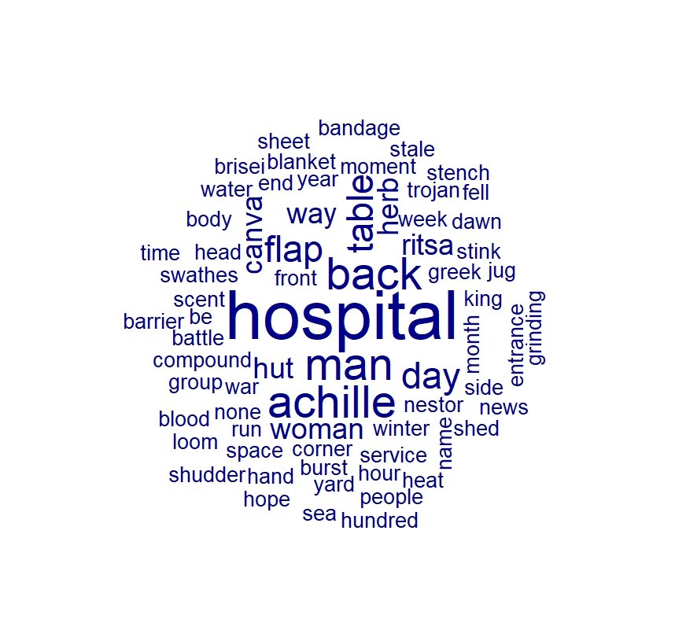
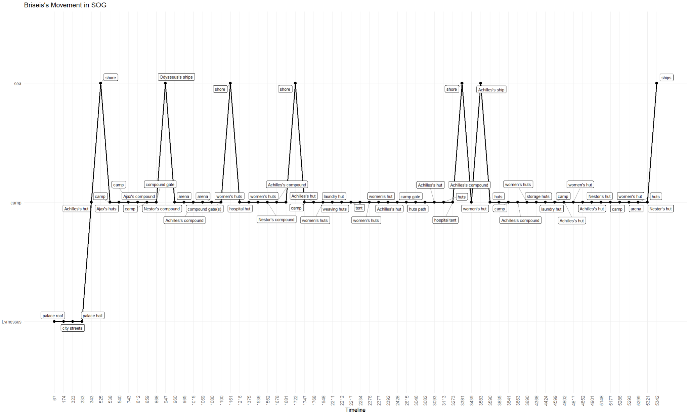
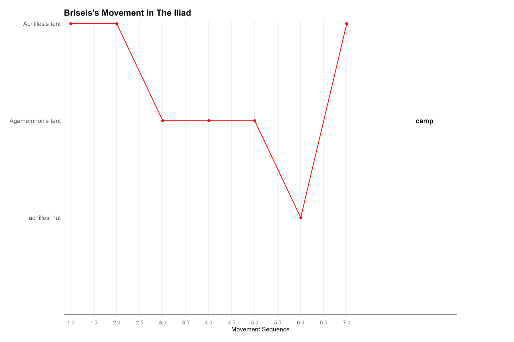
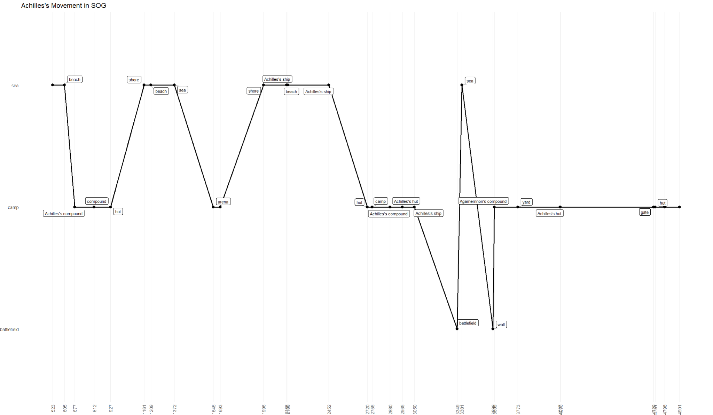
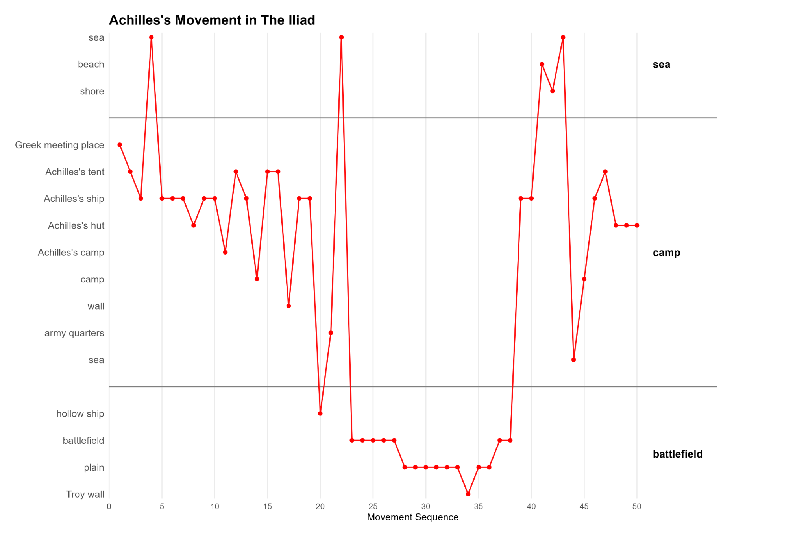

# Reconstruing Narration through Space

### A Comparative Study of *The Iliad* and *The Silence of the Girls*

This repository preserves a 2025 distant-reading course project comparing Emily
Wilson's translation of Homer's *Iliad* (2023) with Pat Barker's *The Silence of
the Girls* (2018).

The project asks how a retelling can redirect narrative attention without changing
the basic outcome of the Trojan War. It approaches this question through space:
the places characters inhabit, the routes along which they move, and the degree of
control they have over entering or leaving particular locations.

## Research questions

1. How does the tent change from a general element of the Greek camp into a more
   differentiated space of care, labour, confinement, and embodied experience?
2. How do the movement trajectories of Briseis and Achilles differ across the two
   texts?
3. What can spatial visibility and mobility reveal about narrative attention,
   gender, possession, and agency?

## Main argument

The pilot study suggests that Barker's novel does more than give Briseis a speaking
voice. It reorganizes the spatial structure inherited from the *Iliad*. The camp is
divided into functionally distinct locations associated with women's labour and
bodily experience, while the battlefield becomes less dominant as the principal
centre of narrative attention. Briseis's confinement therefore becomes spatially
visible and open to comparison.

## Methods

The project combines computational text analysis with manual annotation and close
reading. Its methods include:

- lexical dispersion of spatial terms;
- exploratory semantic comparison around the word `tent`;
- POS-tagged noun collocation analysis;
- manual annotation of macro- and micro-spaces;
- sequential visualization of character movement.

The comparison emphasizes proportions and spatial patterns rather than raw counts,
because *The Silence of the Girls* covers a longer narrative period than the
*Iliad*.

## Repository contents

```text
docs/                 Course paper
data/                 Derived spatial annotations
figures/original/     Figures preserved from the original project
figures/revised/      Cleaner revised movement figures
```

- [Read the course paper](docs/reconstruing_narration_through_space_2025.pdf)
- [Read the data documentation](data/README.md)
- [Read the figure documentation](figures/README.md)

## Findings and visualizations

### 1. Generating female space: the tent

The first part of the project asks whether Barker's `tent` becomes a more specific
and stable spatial node than the broader camp vocabulary of the *Iliad*.



The semantic comparison places `tent` near shore-side stationing and residence in
the *Iliad*, while Barker's novel draws it toward bodily experience, care, and the
hospital.



The dispersion plot shows that `tent` is concentrated in particular narrative
segments of *The Silence of the Girls*, rather than functioning only as a general
camp term.



Nouns surrounding `tent` connect the location to healing, nursing, blood, herbs,
bandages, and other forms of embodied labour. Together, these results support the
paper's argument that Barker generates a differentiated female space inside the
Greek camp.

### 2. Reorganizing Briseis's mobility

| *The Silence of the Girls* | *The Iliad* |
| --- | --- |
|  |  |

In Barker's novel, Briseis moves through a more differentiated set of camp spaces,
including spaces of care, storage, laundry, weaving, and women's collective life.
In the *Iliad*, she appears at only a small number of nodes largely defined by male
ownership. The contrast makes both her mobility and her confinement visible.

### 3. Repositioning Achilles

| *The Silence of the Girls* | *The Iliad* |
| --- | --- |
|  |  |

Achilles's trajectory also changes across the two texts. The *Iliad* gives greater
proportional visibility to battlefield and frontline spaces. Barker returns him
more frequently to the camp and to mundane, embodied settings, while also showing
that he rarely enters many functionally differentiated spaces associated with
women's labour.

For a label-focused view of Achilles's trajectory in Barker's novel, see the
[supplementary movement figure](figures/original/fig_3_5_achilles_movement_sog_supplementary.png).

The complete argument, including the manual KWIC classification reproduced as
Figure 2.4, is available in the [course paper](docs/reconstruing_narration_through_space_2025.pdf).

## Current status and limitations

This repository is a research archive of the recoverable materials associated with
the submitted course paper. It is not yet a fully reproducible computational
package. The original R/R Markdown scripts, the underlying Achilles-in-*SOG*
annotation sheet, and the manual KWIC classification behind Figure 2.4 have not yet
been recovered.

Exploratory emotion figures are intentionally excluded from this paper release.
Spatial emotion is a possible later extension, but it was not one of the paper's
fully developed or reproducible findings.

## Copyright and data availability

The processed full texts of *The Iliad* and *The Silence of the Girls* are omitted
because they are copyrighted. This research archive shares only the paper, small
derived annotation datasets, documentation, and generated visualizations. Please
consult [the data documentation](data/README.md) before reusing the derived files.

## Author

Junyang Wang
